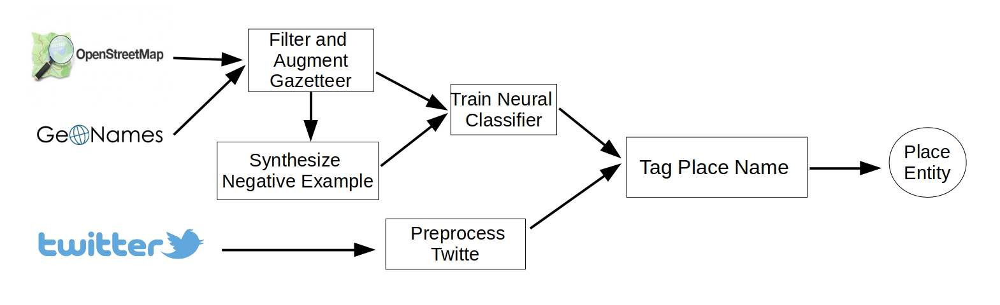
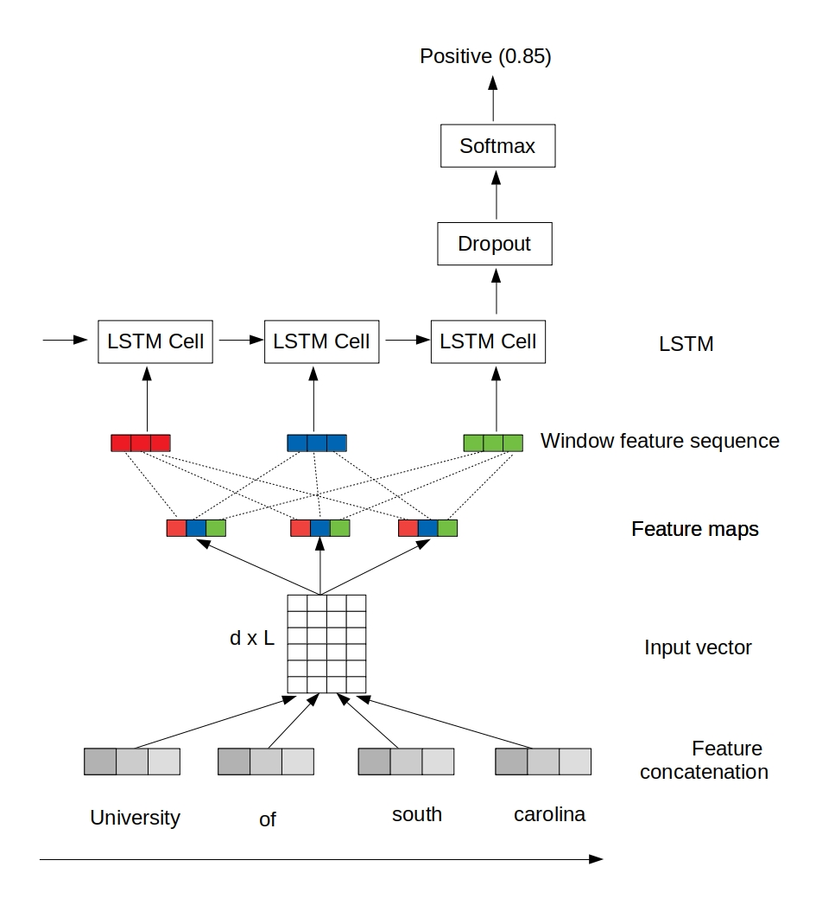

# ZSL-PLT
## Basic description
This study proposes a zero-shot learning approach for place entity tagging from tweets, named ZSL-PLT, which does not assume any annotated sentences at training time. It fuses rule, gazetteer, and deep learning-based approaches to achieve the best performance among all. Specifically, we apply a Convolutional Neural Network (CNN) and Long Short-Term Memory (LSTM)-fused deep learning model called C-LSTM to derive a general place name classifier based on abundant positive examples (around 22 million) from gazetteers (i.e., OpenStreetMap and GeoNames) and negative examples (around 220 million) synthesized by rules. The classifier is then used to score n-gram segments of the tweet text and select the top none-overlapping candidates. We evaluate the approach on 4,500 disaster-related tweets, including around 9,500 place names from three targeted streams corresponding to the floods in Louisiana (the US), Houston (the US), and Chennai (India), respectively. We provide a comparison against several competitive baselines. The results show that the proposed approach improves the average F1-score from 0.81 for the best performing system to 0.87 (a 7\% increase).

The Architecture of ZSL-PLT is as follows:

## Neural Classifier
The first step of ZSL-PLT is to train a model based on positive examples from gazetters and negative examples sythesized by rules.
### Training examples perparation
Used gazetters include OpenStreetMap and Geonames. Specifically, two boundary boxes are choosed to select the osm name entitits from OSMNames (https://osmnames.org/download/). The Geoname data (https://download.geonames.org/export/dump/) in the whole US and India area is used. 
Apart from gazetteers, word-embedding is used to extract general words, including goolge-embedding and Golve-embedding.
Moreover, a file contains 5000 general words provided by lexical is also used.
After got all the data, rawTextProcessing.py can be used to extract the positive examples and negative examples from the data file above.
### Word embedding
We use three kinds of features in the classifier. The input layer concatenates all the features in a single vector. Specifically, the three types are two different word embeddings (i.e., generic and specific), and six handcrafted features. The generic word embedding is the pre-trained GloVe 50-Dimensional Word Vectors to capture generic language use. The second word embedding is employed to capture language use that is specific for each domain. We obtained that using the word2vector algorithm on the positive examples, with a dimension of 30, a minimum word frequency cutoff of 1, and a window size of 2.
### Model training
We apply the C-LSTM  model in classifying the place entities, which combines the CNN and LSTM to achieve the best of both. In C-LSTM, CNN is first applied to extract higher-level sequences of word features. Then, LSTM is applied to capture long-term dependencies over window feature sequences, respectively. The topology of the network is depicted as follows:

