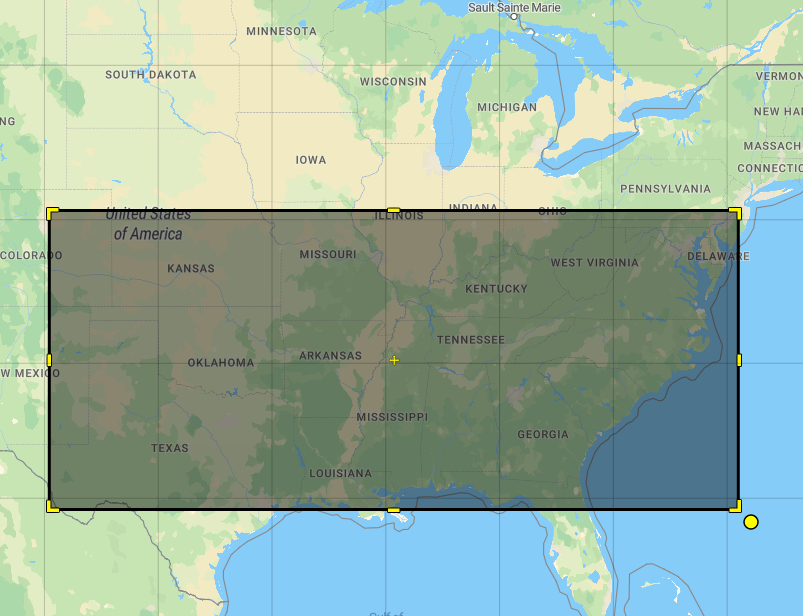
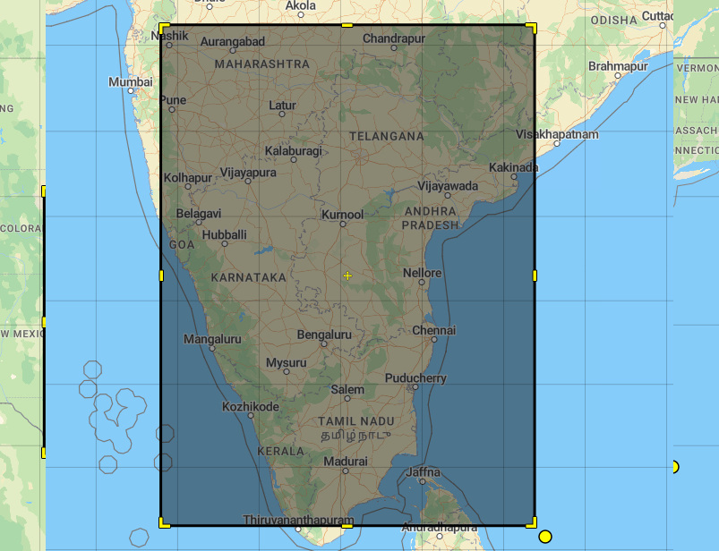
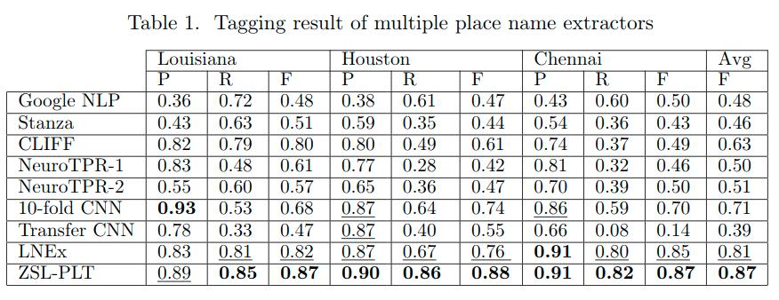

# GazPNE
## 1.Basic description
We propose a hybrid method, named GazPNE, which fuses rules, gazetteers, and deep learning methods to achieve state-of-the-art-performance without requiring any manually annotated data. Specifically,  we utilize C-LSTM, a fusion of Convolutional and Long Short-Term Memory Neural Networks, to decide if an n-gram in a microblog text is a place name or not. The C-LSTM is trained on 4.6 million positive examples extracted from OpenStreetMap and GeoNames and 220 million negative examples synthesized by rules and  evaluated  on  4,500  disaster-related  tweets,  including  9,026 place names from three floods: 2016 in Louisiana (US), 2016 in Houston (US), and 2015 in Chennai (India). Our method improves the previous state-of-the-art by 7\% by achieving an F1 score of 0.87.

The Workflow of GazPNE is shown in the figure below.

## 2.Model training
The first step of GazPNE is to train a classification model based on positive examples from gazetteers and negative examples sythesized by rules.
### Training data perparation
Several important data need to be prepared before generating the positive and negative examples. All data should be put in the  folder.

**OSM data**: We first collect positive examples from OpenStreetMap. Specifically, two boundary boxes are chosen to extract the OSM items via OSMNames (https://osmnames.org/download/), and  they are [-104.79, 29.57, -74.5, 40.31] and [73.59, 8.58, 82.76, 20.47], covering the south US and sount India, respectively, as shown in the figure below. The extracted data are saved in usl.tsv and chennai.tsv, respectively.

  
   

**Geonames data**: Two files named IN.txt and US.txt, can be downloaded via (https://download.geonames.org/export/dump/). They corresponse to the data in the whole US and India areas, respectively. We only need partial entites from GeoNames, such as schools and hospitals, which are not sufficently provided by OSMNames due to technical issues. [geonames.py](geonames.py) is used to extract the require place names from GeoNames.
 > python geonames.py --c IN 
 
 This will generate [in_geonames.txt](data/in_geonames.txt) 
 
 > python geonames.py --c US

This will generate [us_geonames.txt](data/us_geonames.txt) 

**Two word embeddings**: Goolge word embedding ([GoogleNews-vectors-negative300.bin](https://code.google.com/archive/p/word2vec/)) and Golve word embedding ([glove.6B.50d.txt](https://www.kaggle.com/watts2/glove6b50dtxt)).

After preparing the above data, [rawTextProcessing.py](rawTextProcessing.py) is used to extract the positive examples and negative examples. 

 > python rawTextProcessing.py --file 146 --ht 500 --lt 500 --ft 20 --unseen 1
 
Parameter <*file*> denotes the ID of the generated files, saving positive and negative examples, named positive**ID**.txt and negative**ID**.txt

We provide our extracted [positive](https://drive.google.com/file/d/1YQaY9WMYAaPdasx5fz1Namx2XIxjkWIf/view?usp=sharing) and [negative](https://drive.google.com/file/d/1KF5DEOwWq1D7QE9T-CLWy7X1fXJ9-x6S/view?usp=sharing) examples, named positive146.txt and negative146.txt, respectively.

### Specific Word embedding
Specific word embedding can be obtained by applying the word2vector algorithm in the positive examples.

 > python word2vec-garzeteer.py --osmembed 2 --data 146

Parameter <*osmembed*> denotes the ID of the specific word embedding and <*osmembed*> denotes the ID of the file saving the positive examples.

We provide the trained [specific Word embedding](https://drive.google.com/file/d/1xWl87ggoQIysydrXXqgRPr2rB4yzw8GU/view?usp=sharing). It should be put in the  folder.

Next, the file for the negative examples is split into multiple smaller files with each containing at most 10 million lines (examples) to improve the reading effencicy of the negative examples.

 > split -l 10000000 data/negative146.txt data/negative146
 
### Train a C-LSTM model

We apply the C-LSTM  model to classify the place entities, which combines the CNN and LSTM to achieve the best of both. The topology of the network is depicted as follows:

[Garzetter_sim_pre.py](Garzetter_sim_pre.py) is used to train a model based on the positive and negative examples.

 > python -u Garzetter_sim_pre.py --epoch 2 --train-batch-size 1000 --test-batch-size 1000 --split_l 10000000 --model 3 --atten_dim 120 --cnn_hid 120  --filter_option 1 --filter_l 1 --max_cache 10 --hc 1 --osm_word_emb 1 --postive 146 --negative 146 --osmembed 2 --preloadsize 3000000

Parameter <*model*> denotes the type of model that should be trained (CNN:0, Bi-LSTM:1, attention-CNN:2, clstm:3, attention-clstm:4). Two parameters <*postive*> and <*negative*> denote the ID of the file saving the positive examples and negative examples, respectively.

Then, we can get a model named like 'clstm_model_0708233420epoch0.pkl', which is then manually renamed as '0708233420epoch0.pkl'. 0708233420 is the time to create the model, and also used as the ID of the model. We keep the trained model in each epoch. 

Users can also download our [trained model](https://drive.google.com/file/d/10TokPTKJLwpjQR2oN-X03MO1GCEpeDyx/view?usp=sharing) and the other data, such as the total vocabularies and the trained bigram model. They should be put in the  folder.

## 3.Place name tagging from tweet texts
The three annotated [tweet data sets](https://rebrand.ly/LocationsDataset) are also provided and should be put in the  folder. The trained model is then used to extract the place name from the tweet texts through [model_test_json.py](model_test_json.py).

> python -u model_test_json.py --model_ID 0708233420 --atten_dim 120 --hidden 120 --filter_l 1 --epoch 1 --filter 1 --bool_remove 1  --region 1 --model 3 --osmembed 2 --thres 0.86 --bool_embed 0

Parameters <*model_ID*> and <*epoch*> determine which model will be used. Parameter <*model*> denotes the type of used model (CNN:0, Bi-LSTM:1, attention-CNN:2, clstm:3, attention-clstm:4). Parameter <*region*> denotes the test data set (Lousiana:0, Houston:1, Chennai:2). 

## 4.Experimental results

Apart from the annotated gold data, we also test our approach on the raw tweet data but without annotation of the place names, corresponding to the 2018 Florance Hurricane. There are in total 80,000 tweets. Quite good predicition results have also been observed.
