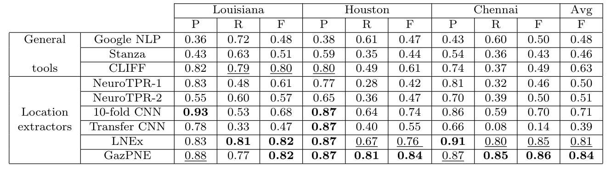

# GazPNE
## 1.Basic description
We propose a hybrid method, named GazPNE, which fuses rules, gazetteers, and deep learning methods without requiring any manually annotated data. It can extract place names at both coarse (e.g., country and city) and fine-grained (e.g., street and creek) levels and
place names with abbreviations (e.g., ‘tx’ for ‘Texas’ and ‘studemont rd’ for ‘studemont road’). The Workflow of GazPNE is shown in the figure below.

Note that if you just want to use our trained model, you can skip the second step. Instead, you can download the [model data](https://drive.google.com/file/d/1j4CSF13Uoajcfh1h-yBuvVXo_-rub05o/view?usp=sharing) and unzip the data into the _model_ folder. Our model was trained based on the OSM data in the US and India. Thus, it can reconginze the place in the two regions.

## 2.Model training
The first step of GazPNE is to train a classification model based on positive examples from gazetteers and negative examples sythesized by rules.
### Training data perparation
Several important data need to be prepared before generating the positive and negative examples. All data should be put in the _data_ folder.

**OpenStreetMap data**: Retrive OSM data in the US and India from ([OSMNames](https://osmnames.org/download/)), which are saved in us.tsv and india.tsv, respectively.

**Two word embeddings**: Google word embedding ([GoogleNews-vectors-negative300.bin](https://code.google.com/archive/p/word2vec/)) and Golve word embedding ([glove.6B.50d.txt](https://www.kaggle.com/watts2/glove6b50dtxt)).

After preparing the above data, [rawTextProcessing.py](rawTextProcessing.py) is used to extract the positive examples and negative examples. 

 > python rawTextProcessing.py --file 216 --ht 500 --lt 500 --ft 500 --unseen 1
 
Parameter <*file*> denotes the ID of the generated files, saving positive and negative examples, named positive**ID**.txt and negative**ID**.txt

We have also provided our extracted [positive](https://drive.google.com/file/d/1DZsclFIWxBS-MpBAfMDJvkfQLeUN9sre/view?usp=sharing) and [negative](https://drive.google.com/file/d/1E8ym0Bqd7LBcHvvgp2eXtiQz8yFJAWf2/view?usp=sharing) examples, named positive216.txt and negative216.txt, respectively.

Next, the file saving the negative examples is split into multiple smaller files with each containing at most 2 million lines (examples) to improve the efficiency of loading the negative examples.

 > split -l 2000000 data/negative216.txt data/negative216
 
### Train a C-LSTM model

We apply the C-LSTM model to classify the place entities, which combines the CNN and LSTM to achieve the best of both. The structure of the network is depicted as follows:

[Gazetteer_weight.py](Gazetteer_weight.py) is used to train a model based on the positive and negative examples.

python -u Gazetteer_weight.py --epoch 7 --train-batch-size 1000 --test-batch-size 1000 --split_l 10000000 --lstm_dim 120 --cnn_hid 120 --filter_l 1 --max_cache 10 --hc 1 --osm_word_emb 1 --positive 216 --negative 216 --osmembed 2 --preloadsize 3000000 --emb 1 --osm_word_emb 0 --max_len=20

Two parameters <*positive*> and <*negative*> denote the ID of the file saving the positive examples and negative examples, respectively.

Then, we can get a model named like 'clstm_model_0708233420epoch0.pkl'. 0708233420 is the time to create the model, and also used as the ID of the model. We keep the trained model in each epoch. 

## 3.Place name tagging from tweet texts

### Install python dependencies

> pip install -r requirements.txt

Python 3.7 is needed 

### Run the code

The test dataset contains 4500 annotated tweets, corresponding to Chennai 2015, Louisiana 2016, and Houston 2016 floods. The three annotated [tweet data sets](https://rebrand.ly/LocationsDataset) should be put under the _data_ folder. The trained model is then used to extract the place name from the tweets through [model_test.py](model_test.py).

> python -u model_test.py --model_ID 0319140518  --epoch 11  --region 1 --thres 0.70

Parameters <*model_ID*> and <*epoch*> determine which model will be used. Parameter <*region*> denotes the test data set (Lousiana:0, Houston:1, Chennai:2). Parameter <*thres*> denotes the score threshold used to select the valid place name.

Execute below command in case of a jave error.  

> spack load openjdk

## 4.Experimental results

Apart from the annotated gold data, we also apply our approach to the data set without annotation, corresponding to the 2018 Florance Hurricane. There are over 100,000 tweets. The tagging result by our approach is saved in [florence_result.txt](experiments/florence_result.txt).

## 5. Citing
If you do make use of GazPNE or any of its components please cite the following publication:

> Xuke Hu, Hussein S. Al-Olimat, Jens Kersten, Matti Wiegmann, Friederike Klan, Yeran Sun & Hongchao Fan (2021) GazPNE: annotation-free deep learning for place name extraction from microblogs leveraging gazetteer and synthetic data by rules, International Journal of Geographical Information Science, DOI: 10.1080/13658816.2021.1947507

## 6. Contact
If you have any questions, feel free to contact Xuke Hu via xuke.hu@dlr.de
